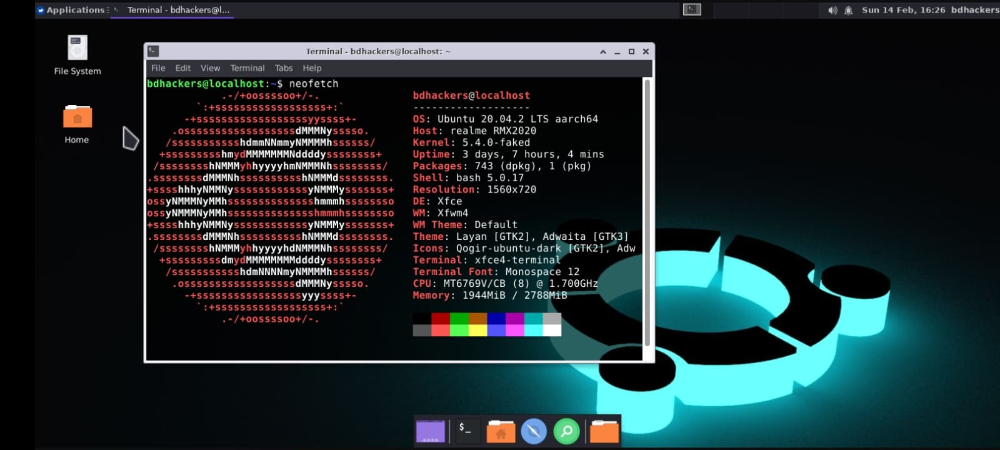
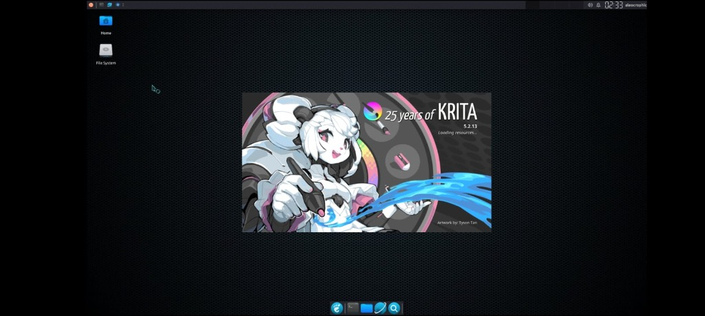
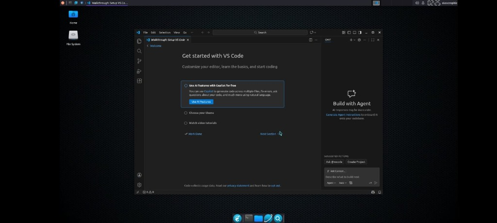
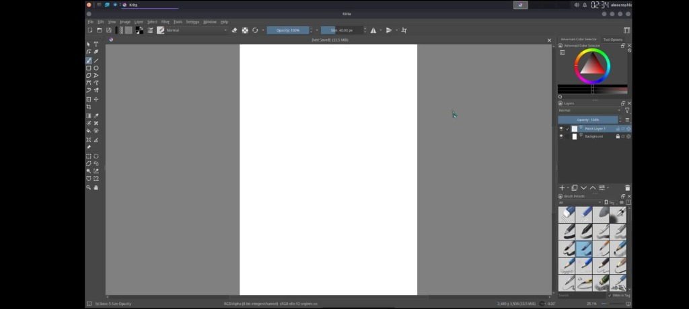
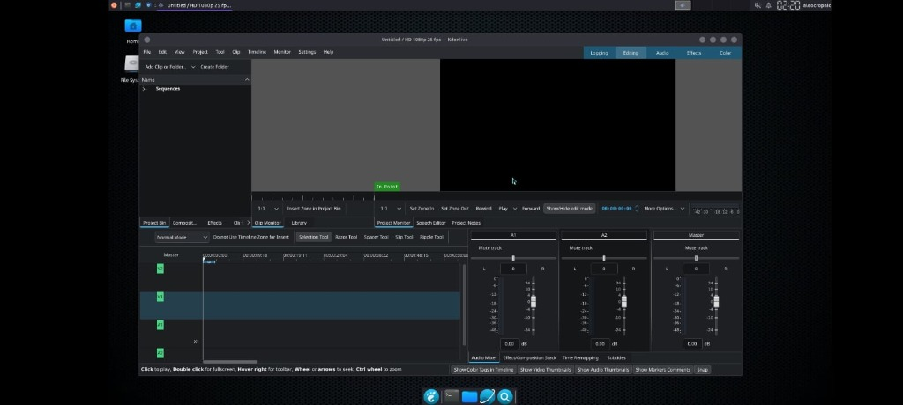
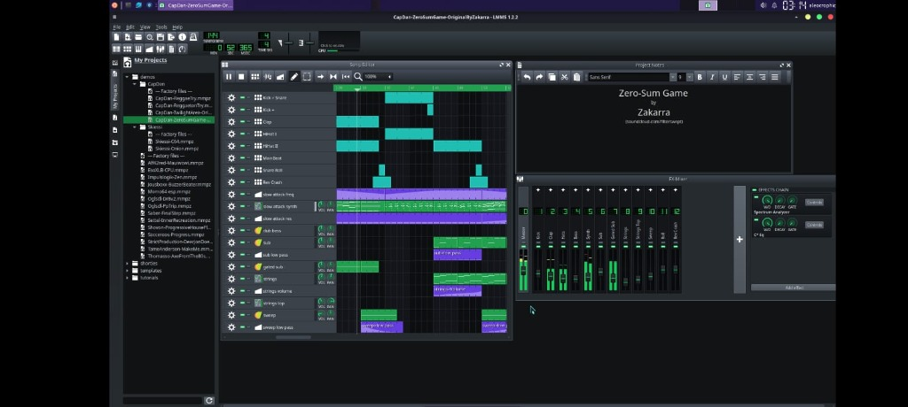

<p align="center">

</p>
<p align="center">


</p>
<p align="center">


</p>

<h1 align="center">🚀 Modded Ubuntu PRO</h1>
<p align="center"><b>Premium High-Performance Ubuntu GUI for Termux with 124+ Pre-Installed Software</b></p>

---

## 📸 Screenshots

<p align="center">

<br><i>Krita - Professional Digital Painting Software</i>
</p>

<table>
<tr>
<td width="50%">

<p align="center"><i>Visual Studio Code - Code Editor</i></p>
</td>
<td width="50%">

<p align="center"><i>Krita - Image Editor Interface</i></p>
</td>
</tr>
<tr>
<td width="50%">

<p align="center"><i>Kdenlive - Video Editor</i></p>
</td>
<td width="50%">

<p align="center"><i>LMMS - Music Production</i></p>
</td>
</tr>
</table>

---

## ⚡ Why PRO Edition?

| Feature           | Original       | PRO Edition                    |
| ----------------- | -------------- | ------------------------------ |
| Software Packages | ~10            | **124+**                       |
| Installation      | Manual prompts | **Fully Automatic**            |
| Audio Support     | Basic          | **Comprehensive Fix**          |
| Theme             | Default XFCE   | **Modern Sleek Dark**          |
| IDE Support       | VSCode only    | **VSCode + Sublime + Geany**   |
| Office Suite      | None           | **LibreOffice Full**           |
| Design Tools      | None           | **GIMP + Inkscape + Krita**    |
| Audio Editing     | None           | **Audacity + LMMS**            |
| Video Editing     | VLC only       | **Kdenlive + OBS + VLC + MPV** |
| Dev Tools         | None           | **Git + Node.js + Python**     |
| Stability         | Good           | **Enterprise-Grade**           |
| Support           | Community      | **Premium**                    |

---

## 🎯 124+ Pre-Installed Features

### 💻 Development & IDE

- Visual Studio Code (Patched for proot)
- Sublime Text Editor
- Geany IDE
- Vim & Nano
- Git & Git Bash
- Node.js & npm
- Python 3 & pip
- Build-essential (GCC, G++, Make)

### 📄 Office & Productivity

- LibreOffice Writer
- LibreOffice Calc
- LibreOffice Impress
- LibreOffice Draw
- Evince PDF Reader

### 🎨 Graphics & Design

- GIMP (Image Editor)
- Inkscape (Vector Graphics)
- Krita (Digital Painting)
- Ristretto (Image Viewer)

### 🎵 Audio Production

- Audacity (Audio Editor)
- LMMS (Music Production)
- PulseAudio (Sound System)
- Pavucontrol (Volume Control)

### 🎬 Video & Media

- VLC Media Player
- MPV Media Player
- Kdenlive (Video Editor)
- FFmpeg (Media Tools)

### 🌐 Browsers & Internet

- Mozilla Firefox
- Chromium Browser
- FileZilla (FTP Client)
- Transmission (Torrent)

### 🔧 System Utilities

- Thunar File Manager
- XArchiver
- Htop (Process Monitor)
- Neofetch
- GParted
- Synaptic Package Manager

### 🎨 Premium Theme Package

- Orchis Dark GTK Theme
- Papirus Dark Icon Theme
- Breeze Cursor Theme
- Custom XFCE Panel Layout
- Premium Wallpaper Collection
- Nerd Fonts Collection

---

## 📦 Installation

### Requirements

- [Termux](https://f-droid.org/repo/com.termux_118.apk) from F-Droid
- Minimum 8GB free storage
- Stable internet connection

### Quick Install

```bash
# Update packages
yes | pkg up

# Install dependencies
pkg install git wget -y

# Clone PRO repository
git clone --depth=1 https://github.com/ZetaGo-Aurum/modded-ubuntu.git

# Navigate and install
cd modded-ubuntu
bash setup.sh
```

### After Installation

```bash
# Restart Termux, then:
ubuntu

# First time setup (creates user):
bash user.sh

# Restart Termux again, then:
ubuntu

# Install GUI (automatic, no prompts):
sudo bash gui.sh
```

### Start VNC

```bash
vncstart    # Start VNC Server
vncstop     # Stop VNC Server
```

Connect with VNC Viewer app → Address: `localhost:1`

---

## 🔊 Audio Fix (Pre-Configured)

Audio is **automatically configured** during installation. No manual setup needed!

The PRO edition includes:

- PulseAudio with AAudio module
- Automatic PULSE_SERVER configuration
- Volume control integration
- Firefox audio support out-of-box

---

## 🗑️ Uninstall

```bash
cd modded-ubuntu
bash remove.sh
```

---

## 📜 Credits

### Original Script

**Modded Ubuntu** - A modded GUI version of Ubuntu for Termux

**Original Maintainers:**

- [**Mustakim Ahmed**](https://github.com/BDhackers009)
- [**Tahmid Rayat**](https://github.com/htr-tech)
- [**0xBaryonyx**](https://github.com/Mahfuz-THBD)

_Made in Bangladesh 🇧🇩_

---

### PRO Remake By

<p align="center">
<b>🔷 ZetaGo-Aurum</b><br>
<i>Under the ALEOCROPHIC Brand</i>
</p>

This PRO edition is a complete remake featuring:

- 124+ pre-installed software packages
- Fully automatic installation
- Comprehensive audio system fix
- Modern sleek dark theme
- Enterprise-grade stability
- High-performance optimizations

---

## 📄 License

Licensed under [Apache License 2.0](./LICENSE)

Ubuntu image provided by [Termux proot-distro](https://github.com/termux/proot-distro)

---

<p align="center">
<b>⭐ If you like this PRO edition, please star the repository! ⭐</b>
</p>
