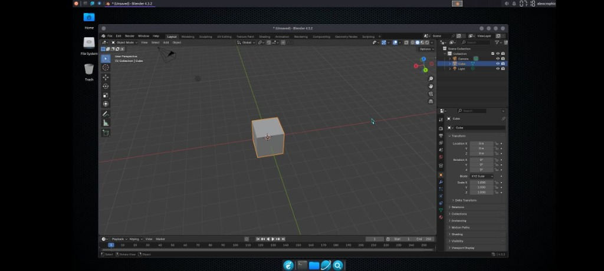

<p align="center">

</p>
<p align="center">


</p>
<p align="center">


</p>

<h1 align="center">🚀 ACRO PRO Edition</h1>
<p align="center"><b>Premium Linux Distribution for Termux with 1000+ Pre-Installed Software</b></p>
<p align="center"><i>Ubuntu 22.04 LTS | 24/7 Keep-Alive | GPU Optimization | Flatpak Support</i></p>

---

## 🆕 What's New in v3.3.3

- **24/7 Keep-Alive** - `acro-keepalive` prevents Android from killing Termux
- **GPU Optimization** - OpenGL 4.5, Mesa llvmpipe, optimized for Blender/Krita
- **Flatpak Support** - Install apps from Flathub with `flatpak`
- **Software Center** - gnome-software for easy app management
- **Synaptic Fixed** - Package manager now works properly
- **Pavucontrol Fixed** - Audio mixer without window glitches
- **Permanent Audio** - PulseAudio auto-starts on `ubuntu` login
- **User Preserved** - Updates don't delete your user account

---

## 📸 Screenshots

<p align="center">

<br><i>Krita 5.2.13 - 25 Years Anniversary Edition</i>
</p>

<table>
<tr>
<td width="50%">

<p align="center"><i>Blender 4.3.2 - 3D Modeling & Animation</i></p>
</td>
<td width="50%">

<p align="center"><i>Krita - Digital Drawing Interface</i></p>
</td>
</tr>
<tr>
<td width="50%">

<p align="center"><i>Kdenlive - Video Editor</i></p>
</td>
<td width="50%">

<p align="center"><i>LMMS - Music Production</i></p>
</td>
</tr>
</table>

---

## ⚡ Why ACRO PRO Edition?

| Feature           | Original       | ACRO PRO v3.3.3                  |
| ----------------- | -------------- | -------------------------------- |
| Software Packages | ~10            | **1000+**                        |
| Installation      | Manual prompts | **Fully Automatic**              |
| Audio Support     | Broken/Manual  | **Permanent Auto-Start**         |
| Theme             | Default XFCE   | **Modern Dark + Custom Wallpaper** |
| IDE Support       | VSCode only    | **VSCode + Sublime + Geany**     |
| Office Suite      | None           | **LibreOffice Full + Calibre**   |
| Design Tools      | None           | **GIMP + Inkscape + Krita + Blender** |
| Audio Editing     | None           | **Audacity + LMMS + Ardour**     |
| Video Editing     | VLC only       | **Kdenlive + OBS + Shotcut**     |
| Dev Tools         | None           | **Python, Node, Go, Rust, Java** |
| Language Support  | English        | **23+ Languages (incl. Indonesian)** |
| Settings Utility  | None           | **Comprehensive mu-settings**    |
| VNC Config        | Fixed          | **Adjustable Resolution/Scale**  |
| Stability         | Good           | **Enterprise-Grade**             |

---

## 🎯 1000+ Pre-Installed Features

### 💻 Development & IDE

- Visual Studio Code (Patched for proot)
- Sublime Text Editor
- Geany IDE with plugins
- Vim & Nano & Micro
- Git, Git LFS, Git Flow
- Node.js & npm (LTS)
- Python 3 + pip + venv + Jupyter
- Ruby, Perl, Lua, Go, Rust, PHP
- Java (OpenJDK)
- GCC, G++, Clang, Make, CMake
- SQLite, MariaDB, PostgreSQL clients

### 📄 Office & Productivity

- LibreOffice Full Suite (Writer, Calc, Impress, Draw, Math)
- Evince, Okular, Zathura PDF Readers
- Calibre E-book Manager
- Scribus Desktop Publishing

### 🎨 Graphics & Design

- GIMP (Image Editor)
- Inkscape (Vector Graphics)
- Krita (Digital Painting)
- Blender (3D Modeling - 64-bit)
- Darktable & RawTherapee (RAW Processing)
- FontForge (Font Editor)
- Synfig & Pencil2D (Animation)

### 🎵 Audio Production

- Audacity (Audio Editor)
- LMMS (Music Production)
- Ardour (DAW)
- PulseAudio with AAudio
- Pavucontrol (Volume Control - Fixed)
- Microphone Input Support

### 🎬 Video & Media

- VLC Media Player
- MPV Media Player
- Kdenlive (Video Editor)
- OpenShot, Shotcut, Pitivi
- OBS Studio (Screen Recording)
- FFmpeg suite
- HandBrake (Video Converter)

### 🌐 Browsers & Internet

- Mozilla Firefox
- Chromium Browser
- FileZilla (FTP Client)
- Transmission, qBittorrent (Torrent)
- Remmina (Remote Desktop)

### 🔧 System Utilities

- Thunar, PCManFM, Nemo File Managers
- Htop, Btop, Glances (Monitoring)
- Neofetch (Fixed for proot)
- GParted, Synaptic
- Ranger, MC (CLI file managers)
- Tmux, Screen, Byobu

### 🔒 Security Tools

- Wireshark, Nmap
- OpenSSH, GPG
- KeePassXC
- ClamAV

### 🌍 Fonts & Languages

- 100+ font families
- Full CJK support (Chinese, Japanese, Korean)
- Arabic, Hebrew, Hindi, Thai, Indonesian
- All Noto fonts collection
- Programming fonts (FiraCode, JetBrains, Hack)

### 🎨 Premium Theme Package

- Orchis Dark GTK Theme
- Papirus Dark Icon Theme
- Breeze Cursor Theme
- Custom XFCE Panel Layout
- Premium Wallpaper Collection

---

## 📦 Installation

### Requirements

- [Termux](https://f-droid.org/repo/com.termux_118.apk) from F-Droid
- **VNC Viewer**: [AVNC](https://play.google.com/store/apps/details?id=com.gaurav.avnc) (Recommended)
- Minimum **15-20GB** free storage
- Stable internet connection

> [!IMPORTANT]
> ### ⚡ Acquire Wakelock First!
> Before starting installation, you **MUST** enable wakelock in Termux to prevent your smartphone from force-stopping Termux during the long installation process.
> 
> **How to enable:**
> 1. Pull down the notification bar
> 2. Find the Termux notification
> 3. Tap **"Acquire wakelock"**
> 
> Or run this command in Termux:
> ```bash
> termux-wake-lock
> ```
> 
> This keeps Termux running in the background during the 1-2 hour installation.

### Fresh Install

```bash
# Update packages
yes | pkg up

# Install dependencies
pkg install git wget -y

# Clone PRO repository
git clone --depth=1 https://github.com/ZetaGo-Aurum/modded-ubuntu.git

# Navigate and install
cd modded-ubuntu
bash setup.sh
```

### After Installation

```bash
# Restart Termux, then:
ubuntu

# First time setup (creates user):
bash user.sh

# Restart Termux again, then:
ubuntu

# Install GUI (automatic, no prompts):
sudo bash gui.sh
```

---

## 🔄 Update Existing Installation

If you already have Modded Ubuntu installed:

```bash
cd modded-ubuntu
git pull
bash update.sh
```

Update options:
- **Quick Update** - Scripts and configs only
- **Full Update** - Scripts + GUI package info
- **GUI Only** - Update GUI installer
- **Settings Only** - Install/update settings utility

---

## ⚙️ Settings Utility

After GUI installation, use the settings utility:

```bash
mu-settings
```

**Features:**
- 🌐 **Language** - Set system language (23+ options incl. Indonesian) - **Saves to .bashrc**
- 🕐 **Timezone** - Configure timezone by region
- 🖥️ **VNC Display** - Adjust resolution, color depth, scale
- 🔊 **Audio** - Test speakers, microphone, restart PulseAudio
- 🎨 **Appearance** - Switch themes, font scaling, DPI
- 🔄 **Hard Reset** - Clear cache, kill all apps, restart fresh

---

## 🖥️ VNC Configuration

### Start VNC

```bash
vncstart    # Start VNC Server
vncstop     # Stop VNC Server
```

Connect with VNC Viewer app → Address: `localhost:1`

### Resolution Settings

Use `mu-settings` → VNC Display to change:
- 720p (1280x720) - Good for phones
- 1080p (1920x1080) - Recommended
- 1440p (2560x1440) - High-end devices
- 4K (3840x2160) - Ultra HD
- Custom resolution

---

## 🔄 Hard Reset (Like Restarting PC)

The `vncreset` command performs a complete session reset:

```bash
vncreset
```

**What it does:**
- Stops VNC server completely
- Kills all X11 applications (Firefox, Chromium, VSCode, etc.)
- Clears thumbnails and session cache
- Clears browser tabs and session data
- Removes VNC lock files and logs
- Clears XFCE session data

This is like restarting your computer - all windows close, cache is cleared, and you start fresh.

---

## 🔊 Audio Configuration

Audio is **automatically configured** during installation including:

- PulseAudio with AAudio module
- Automatic PULSE_SERVER configuration
- Volume control integration (Pavucontrol fixed)
- Firefox/Chromium audio support

> **Note:** Microphone input has limited support in proot environment due to Android/Termux permissions. Audio output works fully.

---

## 🗑️ Uninstall

```bash
cd modded-ubuntu
bash remove.sh
```

---

## 📜 Credits

### Original Script

**Modded Ubuntu** - A modded GUI version of Ubuntu for Termux

**Original Maintainers:**

- [**Mustakim Ahmed**](https://github.com/BDhackers009)
- [**Tahmid Rayat**](https://github.com/htr-tech)
- [**0xBaryonyx**](https://github.com/Mahfuz-THBD)

_Made in Bangladesh 🇧🇩_

---

### PRO Remake By

<p align="center">
<b>🔷 ZetaGo-Aurum</b><br>
<i>Under the ALEOCROPHIC Brand</i>
</p>

This PRO edition v3.1.0 features:

- 1000+ pre-installed software packages
- Fully automatic installation
- Comprehensive audio system with mic input
- Modern sleek dark theme
- Enterprise-grade stability
- Settings utility for easy configuration
- Multi-language support (23+ languages)
- Adjustable VNC resolution and scale

---

## 📄 License

Licensed under [Apache License 2.0](./LICENSE)

Ubuntu image provided by [Termux proot-distro](https://github.com/termux/proot-distro)

---

<p align="center">
<b>⭐ If you like this PRO edition, please star the repository! ⭐</b>
</p>
